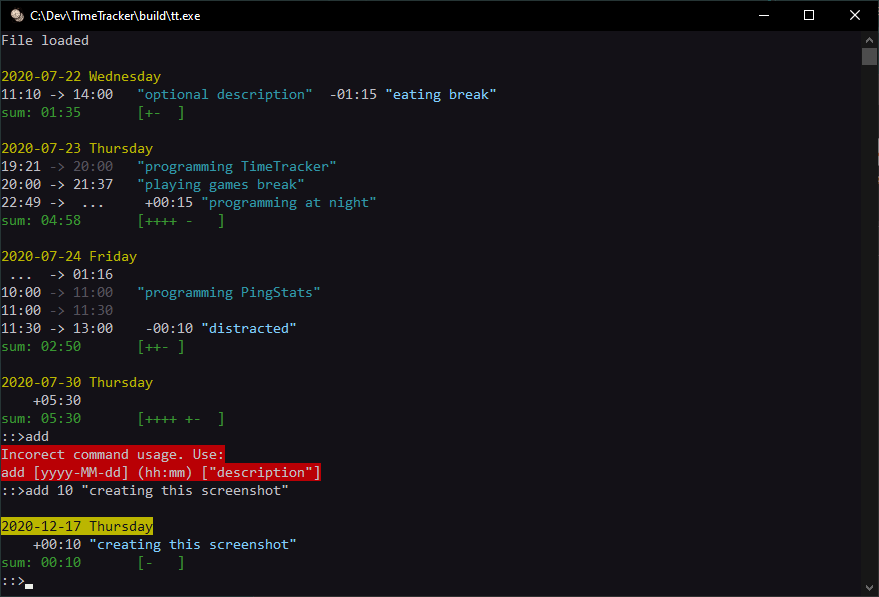

# Time Tracker

This program was designed to work with text files that are easy to edit manually.
It reads the file, validates it, calculates sums and updates it with new formatting and comments.

Changes are saved and archived automatically. If decide to edit the file directly changes will get automatically loaded.


### TODOs
- [ ] Support for advanced queries - selecting from data ranges and/or searching in description.
- [ ] Linux version.

### In action



### Example time_tracker.txt
Raw:
```
start 2020-07-21 11:10 "Optional description";
sub 01:15 "Procrastinating";
stop 14:00;
start 19:21;
stop 21:32;

start 2020-07-22 10:34;
sub 120;
stop 14:22;
add 4:30;

start 2020-07-23 22:49 "TT";
stop 2020-07-24 01:16;

```
After running the program:
```
// Tuesday
start 2020-07-21 11:10 "Optional description";
sub 01:15 "Procrastinating";
stop 14:00;
start 2020-07-21 19:21;
stop 21:32;
// sum: 03:46   [+++-]

// Wednesday
start 2020-07-22 10:34;
sub 02:00;
stop 14:22;
add 04:30;
// sum: 06:18   [++++ ++- ]

// Thursday
start 2020-07-23 22:49 "TT";
stop 2020-07-24 01:16;
// sum: 02:27   [++- ]
```


### Output from 'help' command:
```
Commands available everywhere:
start 2025-12-31 11:20; starts new timespan
stop 2025-12-31 14:12;  stops current timespan
add 01:00;              adds time to current day
                        can also work like: add 2026-01-01 03:00;
sub 01:00;              subtracts time from current day

Commands available only in console:
start & stop assumes current time when unspecified in console
show;                   shows current history
time;                   shows current time...
clear;                  clears the screen
edit;                   opens database file in your default editor
                        works best if your editor supports hot-loading

These actions happen automatically:
save;                   forces save
archive;                forces backup
load;                   forces load from file
```
